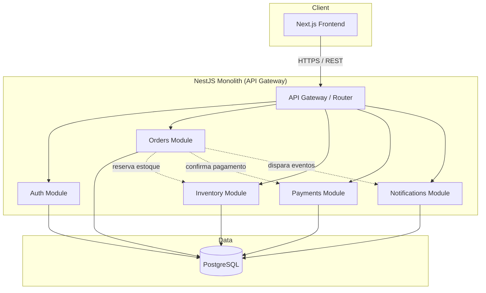
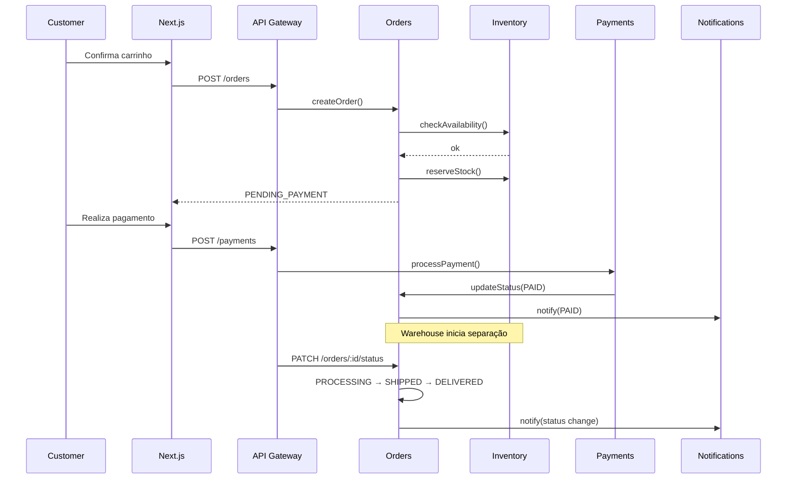

# FlowOrder — Fase 2: Arquitetura

## Visão geral

A arquitetura é pensada em **módulos de domínio** desde o início, mesmo rodando como **monólito NestJS** no MVP. Isso permite evoluir para microserviços no futuro sem reescrever a lógica de negócio.

---

## Diagrama de alto nível



---

## Camadas

```
Next.js (Frontend)
        ↓
API Gateway (NestJS — roteamento, guards, validação)
        ↓
┌───────┬─────────┬───────────┬────────────┬──────────────┐
│ Auth  │ Orders  │ Inventory │ Payments   │ Notifications│
└───────┴─────────┴───────────┴────────────┴──────────────┘
        ↓
   PostgreSQL (Prisma ORM)
```

---

## Módulos e responsabilidades

| Módulo | Responsabilidade |
|--------|------------------|
| **Auth** | Login, registro, JWT, controle de papéis (Customer, Admin, Warehouse, Finance) |
| **Orders** | Criação, listagem e transição de status do pedido |
| **Inventory** | Controle de estoque, reserva e liberação |
| **Payments** | Registro e aprovação de pagamentos, reembolsos |
| **Notifications** | Avisos de mudança de status (e-mail/webhook — stub no MVP) |

---

## Fluxo de um pedido na arquitetura



---

## Estrutura de pastas (monólito NestJS)

```
apps/
  api/
    src/
      modules/
        auth/
        users/
        products/
        orders/
        inventory/
        payments/
        notifications/
      common/          # guards, decorators, filters
      prisma/          # Prisma service
apps/
  web/                 # Next.js frontend
packages/
  shared/              # tipos e enums compartilhados (opcional)
```

---

## Decisões arquiteturais (MVP)

| Decisão | Escolha | Motivo |
|---------|---------|--------|
| Estilo | Monólito modular | Simplicidade; deploy único |
| Comunicação interna | Chamadas diretas entre módulos | Sem Kafka/RabbitMQ no início |
| API | REST + JWT | Padrão, fácil de consumir pelo Next.js |
| Banco | PostgreSQL + Prisma | Tipagem forte, migrations |
| Auth | JWT com roles no payload | Guards por papel no NestJS |

---

## Evolução futura (fora do MVP)

- Extrair módulos em microserviços independentes
- Message broker (Kafka/RabbitMQ) para eventos assíncronos
- API Gateway dedicado (Kong, Traefik)
- Cache (Redis) para sessões e estoque quente

---

## Próxima fase

**Fase 4** — Backend NestJS: Auth → Users → Products → Orders, usando o schema em `apps/api/prisma/schema.prisma`.
