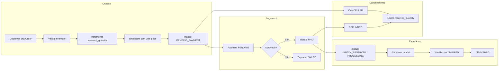

# FlowOrder — Fase 3: Modelagem do Banco

## Visão geral

Banco **PostgreSQL** com **Prisma ORM**. Sete entidades principais cobrem o ciclo de pedido, estoque, pagamento e expedição definidos nas fases anteriores.

---

## Diagrama ER

```mermaid
erDiagram
    User ||--o{ Order : "faz (customer)"
    User ||--o{ Product : "cadastra (admin)"

    Product ||--|| Inventory : "possui"
    Product ||--o{ OrderItem : "referencia"

    Order ||--|{ OrderItem : "contem"
    Order ||--o{ Payment : "gera"
    Order ||--o| Shipment : "expede"

    User {
        uuid id PK
        string email UK
        string password_hash
        string name
        enum role
        datetime created_at
        datetime updated_at
    }

    Product {
        uuid id PK
        string name
        string description
        decimal price
        string sku UK
        boolean active
        uuid created_by_id FK
        datetime created_at
        datetime updated_at
    }

    Inventory {
        uuid id PK
        uuid product_id FK UK
        int quantity
        int reserved_quantity
        datetime updated_at
    }

    Order {
        uuid id PK
        uuid customer_id FK
        enum status
        decimal total_amount
        string shipping_street
        string shipping_city
        string shipping_state
        string shipping_zip
        datetime created_at
        datetime updated_at
    }

    OrderItem {
        uuid id PK
        uuid order_id FK
        uuid product_id FK
        int quantity
        decimal unit_price
        decimal subtotal
    }

    Payment {
        uuid id PK
        uuid order_id FK
        decimal amount
        enum status
        enum method
        string external_id
        datetime paid_at
        datetime refunded_at
        datetime created_at
    }

    Shipment {
        uuid id PK
        uuid order_id FK UK
        string tracking_code
        string carrier
        enum status
        datetime shipped_at
        datetime delivered_at
        datetime created_at
        datetime updated_at
    }
```

---

## Enums

### `UserRole`

| Valor | Uso |
|-------|-----|
| `CUSTOMER` | Cliente que compra |
| `ADMIN` | Cadastra produtos, gerencia plataforma |
| `WAREHOUSE` | Separação e expedição |
| `FINANCE` | Pagamentos e reembolsos |

### `OrderStatus`

Alinhado à Fase 1:

`PENDING_PAYMENT` → `PAID` → `STOCK_RESERVED` → `PROCESSING` → `SHIPPED` → `DELIVERED`

Estados terminais alternativos: `CANCELLED`, `REFUNDED`

### `PaymentStatus`

| Valor | Descrição |
|-------|-----------|
| `PENDING` | Aguardando confirmação |
| `APPROVED` | Pagamento aprovado |
| `FAILED` | Falha no pagamento |
| `REFUNDED` | Valor reembolsado |

### `PaymentMethod`

`CREDIT_CARD` · `PIX` · `BOLETO`

### `ShipmentStatus`

`PENDING` · `PROCESSING` · `SHIPPED` · `DELIVERED`

---

## Entidades

### User

Representa qualquer usuário autenticado do sistema.

| Campo | Tipo | Observação |
|-------|------|------------|
| `id` | UUID | PK |
| `email` | String | Único, login |
| `password_hash` | String | bcrypt |
| `name` | String | Nome exibido |
| `role` | UserRole | Papel de acesso |
| `created_at` | DateTime | |
| `updated_at` | DateTime | |

---

### Product

Catálogo de itens vendáveis. Somente **Admin** pode criar (regra de negócio).

| Campo | Tipo | Observação |
|-------|------|------------|
| `id` | UUID | PK |
| `name` | String | |
| `description` | String? | Opcional |
| `price` | Decimal(10,2) | Preço unitário |
| `sku` | String | Código único do produto |
| `active` | Boolean | Visível no catálogo |
| `created_by_id` | UUID | FK → User (Admin) |
| `created_at` | DateTime | |
| `updated_at` | DateTime | |

---

### Inventory

Estoque por produto (relação 1:1). Separa quantidade física da reservada.

| Campo | Tipo | Observação |
|-------|------|------------|
| `id` | UUID | PK |
| `product_id` | UUID | FK → Product, único |
| `quantity` | Int | Total em estoque |
| `reserved_quantity` | Int | Reservado por pedidos abertos |
| `updated_at` | DateTime | |

**Disponível** = `quantity - reserved_quantity` (calculado na aplicação, não persistido).

Regras:
- Pedido só é criado se `disponível >= quantidade solicitada`
- Ao confirmar pedido, `reserved_quantity` incrementa
- Ao cancelar/reembolsar, reserva é liberada

---

### Order

Pedido do cliente. Status central do fluxo.

| Campo | Tipo | Observação |
|-------|------|------------|
| `id` | UUID | PK |
| `customer_id` | UUID | FK → User (Customer) |
| `status` | OrderStatus | Estado atual |
| `total_amount` | Decimal(10,2) | Soma dos itens |
| `shipping_street` | String | Endereço de entrega |
| `shipping_city` | String | |
| `shipping_state` | String | |
| `shipping_zip` | String | |
| `created_at` | DateTime | |
| `updated_at` | DateTime | |

---

### OrderItem

Itens do pedido com **snapshot de preço** (o preço do produto pode mudar depois).

| Campo | Tipo | Observação |
|-------|------|------------|
| `id` | UUID | PK |
| `order_id` | UUID | FK → Order |
| `product_id` | UUID | FK → Product |
| `quantity` | Int | Qtd comprada |
| `unit_price` | Decimal(10,2) | Preço no momento da compra |
| `subtotal` | Decimal(10,2) | `quantity × unit_price` |

Índice composto: `(order_id, product_id)`

---

### Payment

Registro financeiro vinculado ao pedido. **Finance** consulta e acompanha reembolsos.

| Campo | Tipo | Observação |
|-------|------|------------|
| `id` | UUID | PK |
| `order_id` | UUID | FK → Order |
| `amount` | Decimal(10,2) | Valor cobrado |
| `status` | PaymentStatus | |
| `method` | PaymentMethod | |
| `external_id` | String? | ID do gateway de pagamento |
| `paid_at` | DateTime? | Quando aprovado |
| `refunded_at` | DateTime? | Quando reembolsado |
| `created_at` | DateTime | |

Um pedido pode ter mais de um pagamento (ex.: tentativa falha + nova tentativa, ou registro de reembolso).

---

### Shipment

Dados de expedição. Criado quando o pedido entra em separação.

| Campo | Tipo | Observação |
|-------|------|------------|
| `id` | UUID | PK |
| `order_id` | UUID | FK → Order, único (1:1) |
| `tracking_code` | String? | Código de rastreio |
| `carrier` | String? | Transportadora |
| `status` | ShipmentStatus | |
| `shipped_at` | DateTime? | Data de envio |
| `delivered_at` | DateTime? | Data de entrega |
| `created_at` | DateTime | |
| `updated_at` | DateTime | |

**Warehouse** atualiza `status`, `tracking_code` e datas de envio.

---

## Relacionamentos

| De | Para | Cardinalidade | Descrição |
|----|------|---------------|-----------|
| User | Order | 1:N | Customer possui pedidos |
| User | Product | 1:N | Admin cadastrou produtos |
| Product | Inventory | 1:1 | Cada produto tem um registro de estoque |
| Product | OrderItem | 1:N | Produto aparece em itens de pedido |
| Order | OrderItem | 1:N | Pedido tem N itens |
| Order | Payment | 1:N | Pedido pode ter pagamentos/reembolsos |
| Order | Shipment | 1:1 | Pedido tem uma expedição |

---

## Fluxo de dados por etapa



---

## Índices recomendados

| Tabela | Índice | Motivo |
|--------|--------|--------|
| `users` | `email` (unique) | Login |
| `products` | `sku` (unique) | Busca por código |
| `orders` | `customer_id` | Listagem por cliente |
| `orders` | `status` | Filtro no dashboard |
| `order_items` | `order_id` | Itens do pedido |
| `payments` | `order_id` | Pagamentos do pedido |
| `inventory` | `product_id` (unique) | Lookup rápido |

---

## Schema Prisma

Arquivo de referência em `apps/api/prisma/schema.prisma` — usado na Fase 4 pelo NestJS.

---

## Decisões de modelagem (MVP)

| Decisão | Escolha | Motivo |
|---------|---------|--------|
| Endereço | Campos flat no `Order` | Simplicidade; sem tabela `Address` no MVP |
| Preço no pedido | Snapshot em `OrderItem.unit_price` | Integridade histórica |
| Estoque | 1:1 com `Product` | Um armazém lógico no início |
| Expedição | 1:1 com `Order` | Um envio por pedido |
| Histórico de status | Não modelado | Pode virar `OrderStatusHistory` depois |

---

## Próxima fase

**Fase 4** — Backend NestJS: Auth → Users → Products → Orders, usando este schema Prisma.
