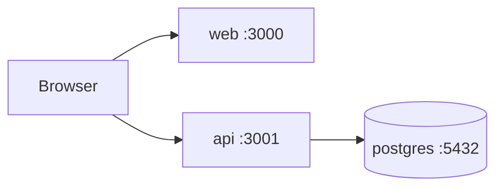

# FlowOrder — Fase 6: Docker

Orquestração com Docker Compose: **PostgreSQL**, **API NestJS** e **Frontend Next.js**.

## Como rodar

Na raiz do projeto:

```bash
docker compose up --build
```

| Serviço | URL |
|---------|-----|
| Frontend | http://localhost:3000 |
| API | http://localhost:3001/api |
| PostgreSQL | localhost:5432 |

## Serviços



### postgres

- Imagem: `postgres:16-alpine`
- Credenciais: `floworder` / `floworder`
- Volume persistente: `postgres_data`
- Healthcheck antes de subir a API

### api

- Build: `apps/api/Dockerfile`
- Na inicialização: `prisma migrate deploy` + `prisma db seed`
- Variáveis: `DATABASE_URL`, `JWT_SECRET`, `PORT`

### web

- Build: `apps/web/Dockerfile` (Next.js standalone)
- `NEXT_PUBLIC_API_URL` aponta para `http://localhost:3001/api` (acessível pelo browser)

## Comandos úteis

```bash
# Subir em background
docker compose up -d --build

# Ver logs
docker compose logs -f api

# Parar e remover containers
docker compose down

# Parar e remover volumes (reset do banco — use se migration falhar)
docker compose down -v
```

## Troubleshooting

### `exec ./docker-entrypoint.sh: no such file or directory`

Causa: fim de linha Windows (CRLF) no script shell. O Dockerfile já corrige com `sed` e `ENTRYPOINT ["sh", ...]`.

### `P3009 — failed migrations`

Causa: uma tentativa anterior de migration falhou e ficou registrada no banco.

```bash
docker compose down -v
docker compose up --build
```

### Migration aplicada mas tabelas não existem

Causa: `migration.sql` gerado com encoding UTF-16 pelo PowerShell. O arquivo deve estar em **UTF-8**. Regenerar com:

```bash
cd apps/api
node -e "const {execSync}=require('child_process'); const fs=require('fs'); const sql=execSync('npx prisma migrate diff --from-empty --to-schema-datamodel prisma/schema.prisma --script',{encoding:'utf8'}); fs.writeFileSync('prisma/migrations/20250701000000_init/migration.sql', sql, 'utf8');"
```

Depois: `docker compose down -v && docker compose up --build`

## Desenvolvimento local (sem Docker)

```bash
# Terminal 1 — Postgres local ou docker só do banco
cd apps/api && npm run start:dev

# Terminal 2
cd apps/web && npm run dev
```

## Arquivos

| Arquivo | Descrição |
|---------|-----------|
| `docker-compose.yml` | Orquestração dos 3 serviços |
| `apps/api/Dockerfile` | Build multi-stage da API |
| `apps/api/docker-entrypoint.sh` | Migrate + seed + start |
| `apps/web/Dockerfile` | Build standalone do Next.js |
